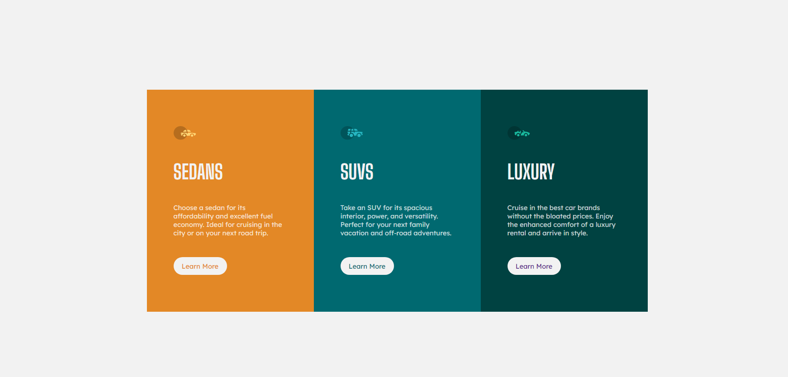

# Frontend Mentor - 3-column preview card component solution

This is a solution to the [3-column preview card component challenge on Frontend Mentor](https://www.frontendmentor.io/challenges/3column-preview-card-component-pH92eAR2-). Frontend Mentor challenges help you improve your coding skills by building realistic projects. 

## Table of contents

- [Overview](#overview)
  - [The challenge](#the-challenge)
  - [Screenshot](#screenshot)
  - [Links](#links)
  - [Built with](#built-with)
  - [What I learned](#what-i-learned)
  - [Continued development](#continued-development)
- [Author](#author)

### The challenge

Users should be able to:

- View the optimal layout depending on their device's screen size
- See hover states for interactive elements

### Screenshot

### Links

- Solution URL: [Add solution URL here](https://github.com/LeoCoronel/3-column)

### Built with

- Semantic HTML5 markup
- SCSS & CSS Custom Properties
- Flexbox
- CSS Grid
- Mobile-first workflow

### What I learned

During this challenge i learned BEM to make css styling easier and cleaner for maintenance. Also i put on practice a few things that i learned for scss like the & selector.

To start with BEM method i've first watched this video [You Probably Need BEM CSS in Your Life (Tutorial)](https://www.youtube.com/watch?v=er1JEDuPbZQ&t=834s)

### Continued development

On future projects i want to scale the magnitude of it, i fell capable and secure to work with extensives css and the BEM method simplified a lot of errors i made on other projects that took a lot of time to solve fighting with selectors.

## Author

- Website - [Portfolio](http://leo-coronel.com.ar)
- Frontend Mentor - [@LeoCoronel](https://https://www.frontendmentor.io/profile/LeoCoronel)
- Github - [@LeoCoronel](https://https://github.com/LeoCoronel)